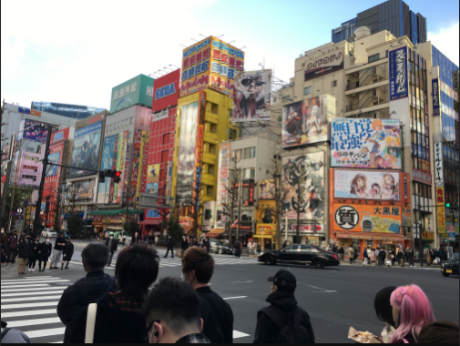
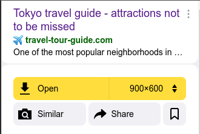
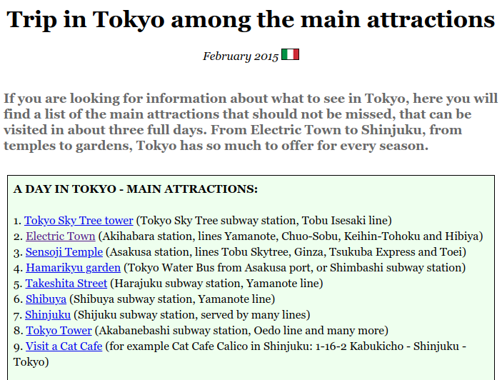
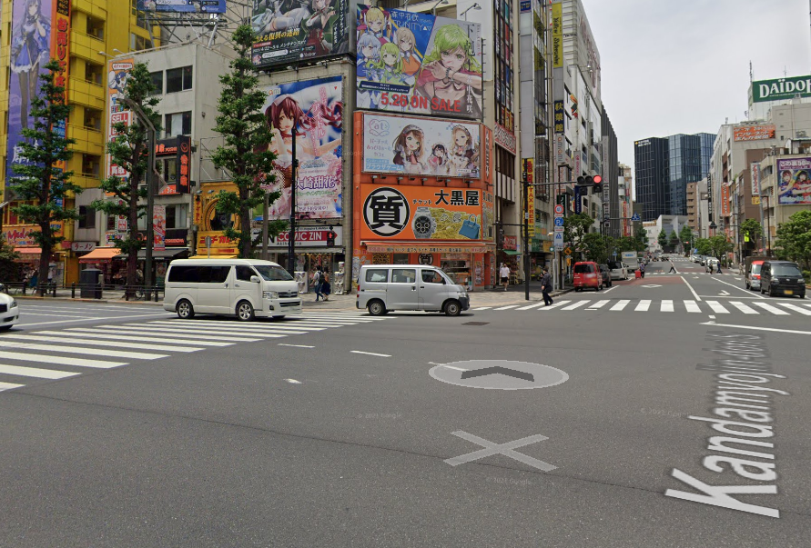
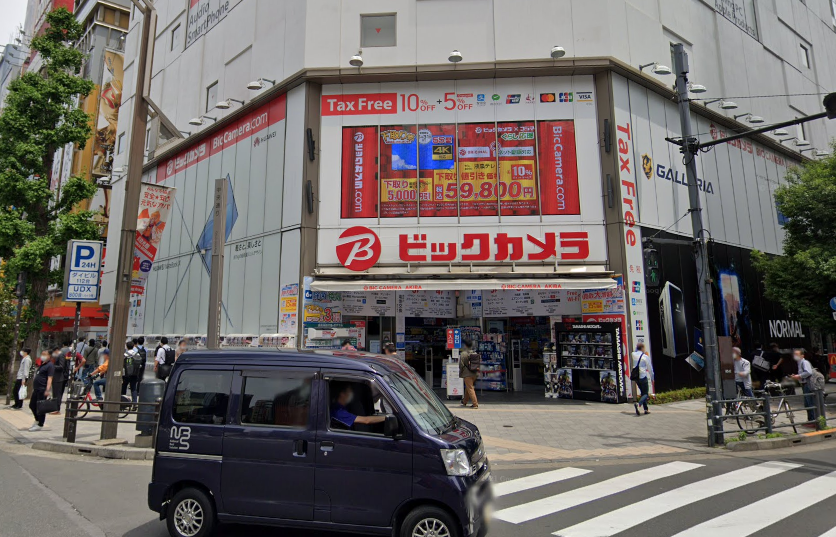
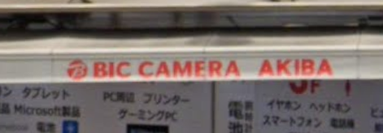

## Part 2 - The Land of Culture

Category: OSINT
Points: 75
Description:

>What culturally relevant shop is this photo taken from? 
>Please submit the answer with the flag format, replacing all spaces (`⠀`) with underscores (`_`). E.g. `DO{...}` 
>(3 words)

---
We get to download an image Challenge_2.jfif

Using our preferred image search engine: Yandex, we get a large amount of similar images back.

Using the second image we find that it links to a Tokyo Travel guide.

It lists a number of attractions and if you move down the list, you will see images that relate to out search, in this case Electric Town is the location we need.

A quick Google search provide more details:

For reference from wikipedia:
> Akihabara is a common name for the area around Akihabara Station in the Chiyoda ward of Tokyo, Japan. Administratively, the area called Akihabara mainly belongs to the Sotokanda and Kanda-Sakumachō districts in Chiyoda. There exists an administrative district called Akihabara in the Taitō ward further north of Akihabara Station, but it is not the place people generally refer to as Akihabara. 
> The name Akihabara is a shortening of Akibagahara, which ultimately comes from Akiba, named after a fire-controlling deity of a firefighting shrine built after the area was destroyed by a fire in 1869.
> Akihabara gained the nickname Akihabara Electric Town shortly after World War II for being a major shopping center for household electronic goods and the post-war black market.
> Akihabara is considered by many to be the centre of modern Japanese popular culture and a major shopping district for video games, anime, manga, electronics and computer-related goods. Icons from popular anime and manga are displayed prominently on the shops in the area, and numerous maid cafés and some arcades are found throughout the district.

Who says you don't learn from CTFs 😀

Now we know the location, using Google Maps and street view, we can get to the crossroads. If we locate ourselves on the place where the original image was taken from:

We can just turn round and see where we are:

So it is a shop, and if we zoom in we can see the name in English.

We now complete the challenge by adding underscores.

FLAG:
DO{BIC_CAMERA_AKIBA}
